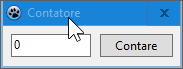
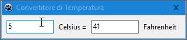
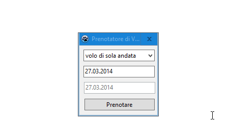
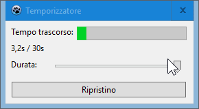

# Lazarus 7GUIs

Esempi di [7GUIs](https://eugenkiss.github.io/7guis/tasks) realizzati con [Lazarus](https://www.lazarus-ide.org/).

## Contatore

## Convertitore di Temperatura

## Prenotatore di Voli

## Temporizzatore

